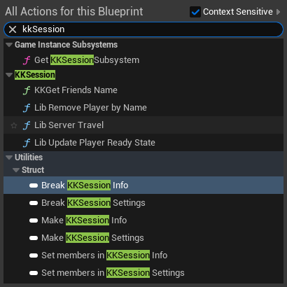
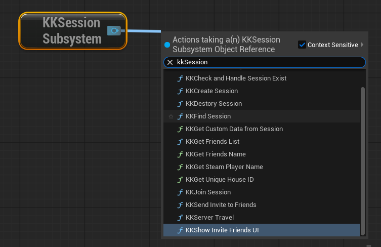
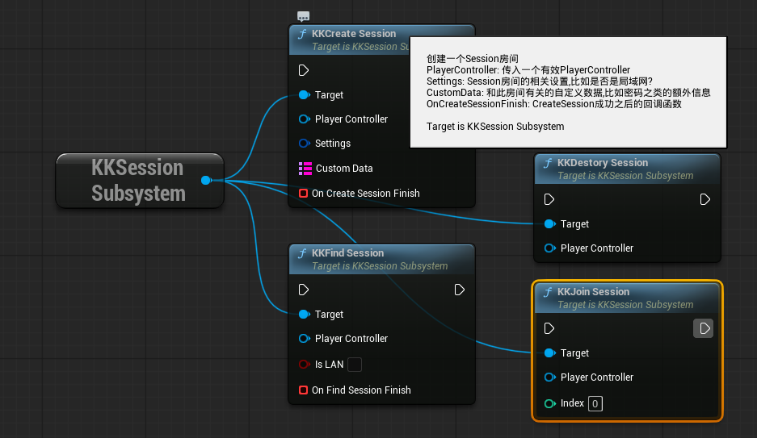
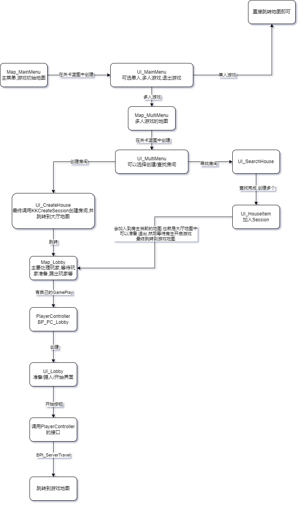

# SteamNetLobby
适用于UE的网络大厅,附带示例代码;可以直接使用;
所有节点有完整的注释说明;


# the steam config settings

change the **DefaultEngine.ini**

```ini
[/Script/Engine.Engine]
!NetDriverDefinitions=ClearArray
+NetDriverDefinitions=(DefName="GameNetDriver",DriverClassName="/Script/OnlineSubsystemSteam.SteamNetDriver",DriverClassNameFallback="/Script/OnlineSubsystemUtils.IpNetDriver")

[OnlineSubsystem]
DefaultPlatformService=Steam
PollingIntervalInMs=20
 

[OnlineSubsystemSteam]
bEnabled=true
SteamDevAppId=YourSteamAPPID
GameServerQueryPort=27015
bRelaunchInSteam=false
GameVersion=1.0.0.0
bVACEnabled=1
bAllowP2PPacketRelay=true
P2PConnectionTimeout=90
```

# 节点功能图





# 示例代码流程图
